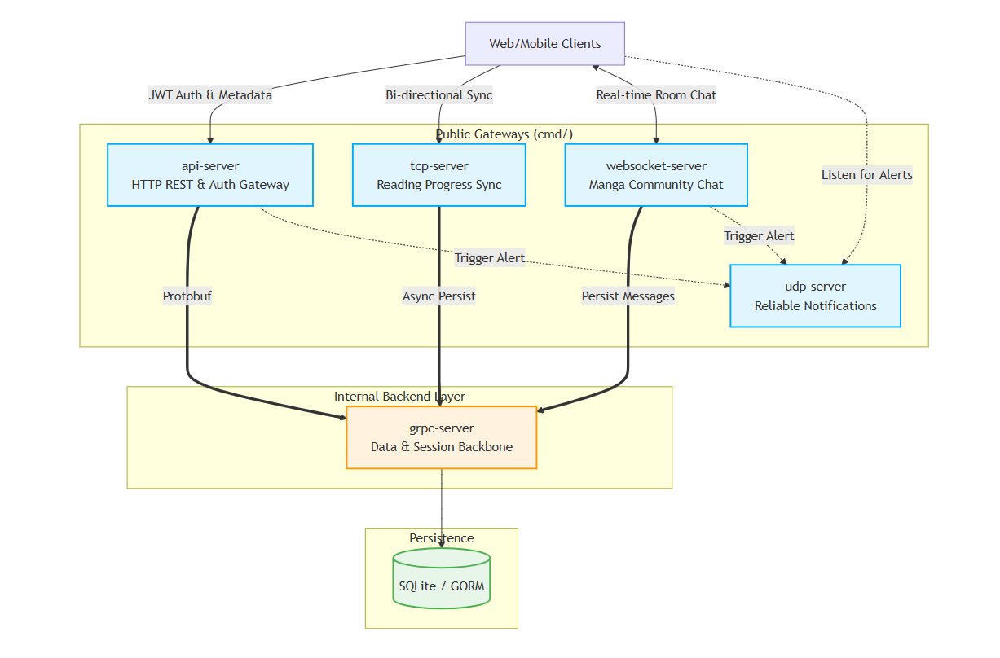
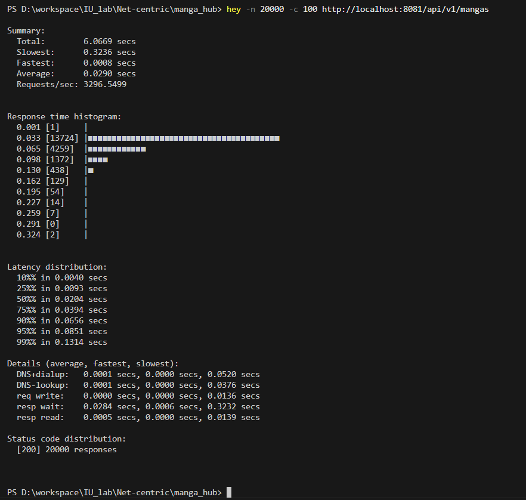

# MangaHub — High-Throughput Distributed Content Tracking Platform

[](https://golang.org/)
[](#)
[](https://opensource.org/licenses/MIT)

---

## Table of Contents
1. [Executive Summary](#1-executive-summary)
2. [System Architecture](#2-system-architecture)
3. [Performance & Benchmarks](#3-performance--benchmarks) 🚀
4. [Core Capabilities](#4-core-capabilities)
5. [Project Structure](#5-project-structure)
6. [Technology Stack](#6-technology-stack)
7. [Getting Started](#7-getting-started)
8. [API Documentation](#8-api-documentation)
9. [License & Contact](#9-license)

---

## 1. Executive Summary
**MangaHub** is a distributed backend service built to handle **high-frequency user telemetry** and **real-time interactions**. Instead of routing all traffic through a bottlenecked REST API, it utilizes a multi-protocol approach (**HTTP**, **TCP**, **UDP**, **gRPC**, **WebSocket**) matching the appropriate transport layer to the specific I/O profile of each feature.

### Design Philosophy
The architecture is rooted in **separation of concerns**. By strictly decoupling the external network gateways from the core business logic via an **internal gRPC backbone**, the system isolates failures. *An I/O spike in the WebSocket chat room will not degrade the performance of the HTTP API*. This modularity ensures the codebase remains **highly testable** and prepared for **horizontal scaling**.

---

## 2. System Architecture

MangaHub operates as a cluster of specialized gateway services communicating internally via a high-speed gRPC backbone.



### Component Breakdown

*   **`api-server` (Public API Gateway)**: The primary entry point for all client applications, managing user identity and providing high-speed access to the content library and metadata.
*   **`tcp-server` (Cross-device, Real-time Sync)**: Enables seamless cross-device synchronization, ensuring a user's reading progress is instantly updated and accessible across their entire device ecosystem.
*   **`websocket-server` (Community Chat)**: Facilitates real-time, room-based social interactions, providing a low-latency environment for community engagement.
*   **`udp-server` (Smart Notifications)**: Delivers high-priority alerts for new chapters and messages with extreme efficiency and guaranteed delivery.
*   **`grpc-server` (Core Data Backbone)**: The system's "source of truth," orchestrating secure data transactions and maintaining consistency across all distributed components.

---

## 3. Performance & Benchmarks 🚀

### 3.1 Test Environment & Tools
*   **Hardware**: Windows 11, Intel Core i7 gen 10th (Ice-lake), 8GB RAM.
*   **Testing Tools**: 
    *   `hey` for HTTP Throughput.
    *   Custom Go stress-test scripts for TCP & UDP reliability.

### 3.2 HTTP API Throughput (REST via gRPC)
*Tested with 100 concurrent users sending 20,000 requests to the `/api/v1/mangas` endpoint:*

| Metric | Result |
|:---|:---|
| **Average Latency** | `29.0 ms` |
| **p95 Latency** | `85.1 ms` |
| **p99 Latency** | `131.4 ms` |
| **Requests Per Second (RPS)** | `3,290+ req/sec` |

<details>
<summary><b>📊 Click to view HTTP Benchmark Evidence</b></summary>


</details>

### 3.3 Real-time Connections (TCP)
*   **Concurrent Handling**: Successfully maintained **2,000+** active "Ping-Pong-Ack" sessions through the complete stack (Middleware -> Dispatcher -> Handler).
*   **Memory Footprint**: The entire TCP server consumed only **~72.8 MB** of RAM during peak load.
*   **Efficiency**: Approximately **~36 KB** per active connection.

<details>
<summary><b>📊 Click to view TCP Evidence</b></summary>

#### Real-time Processing (Ping-Pong-Ack Loop) & RAM Usage (2,000 Connections)

</details>

### 3.4 Reliability & Efficiency (UDP)
*   **High-Speed Processing**: Processed **2,000 packets** in just **3.2 seconds**.
*   **Reliability**: Achieved **100.00% delivery success** in local network benchmarks.
*   **Minimal Footprint**: The UDP server operates with an extremely low memory overhead of only **~5.9 MB**.

<details>
<summary><b>📊 Click to view UDP Evidence</b></summary>

#### High-Speed Processing (2,000 packets in 3.2s)

</details>

---

## 4. Core Capabilities
*   **Multi-Protocol Orchestration**: Seamlessly bridges 5 distinct protocols into a unified user experience.
*   **Security at Scale**: RSA-signed JWTs with cross-protocol public key synchronization.
*   **Resilient Data Pipelines**: Automated seeder for MangaDex with smart rate-limiting and backoff to ensure high-quality data ingestion.

---

## 5. Project Structure

Following **Domain-Driven Design (DDD)** and **Clean Architecture**:

```text
manga_hub/
├── cmd/                # Application Layer (Network Gateways)
│   ├── api-server/
│   ├── grpc-server/
│   ├── tcp-server/
│   ├── udp-server/
│   └── websocket-server/
├── internal/           # Protected Business Logic
│   ├── auth/
│   ├── database/
│   ├── grpc/
│   ├── manga/
│   ├── repository/
│   ├── tcp/
│   ├── udp/
│   ├── user/
│   └── websocket/
├── pkg/                # Shared Utilities & Clients
│   ├── clients/
│   ├── dto/
│   ├── logger/
│   ├── models/
│   ├── seeder/
│   └── utils/
└── proto/              # RPC Contracts
```

<details>
<summary><b>📂 Click to expand Full Directory Tree</b></summary>

```text
manga_hub/
├── cmd/
│   ├── api-server/
│   │   ├── controllers/
│   │   ├── middleware/
│   │   └── routes/
│   ├── grpc-server/
│   ├── tcp-server/
│   │   ├── dispatch/
│   │   ├── handler/
│   │   ├── middleware/
│   │   └── utils/
│   │       └── pools/
│   │           └── impl/
│   ├── udp-server/
│   │   ├── dispatch/
│   │   ├── handler/
│   │   ├── middleware/
│   │   └── utils/
│   │       └── pools/
│   │           └── impl/
│   └── websocket-server/
│       ├── handler/
│       ├── middleware/
│       └── utils/
│           └── pool/
│               └── impl/
├── data/
├── docs/
├── internal/
│   ├── auth/
│   │   └── impl/
│   ├── database/
│   │   └── impl/
│   ├── grpc/
│   │   └── impl/
│   ├── manga/
│   │   └── impl/
│   ├── repository/
│   │   └── impl/
│   ├── tcp/
│   │   └── impl/
│   ├── udp/
│   │   └── impl/
│   ├── user/
│   │   └── impl/
│   └── websocket/
│       └── impl/
├── pkg/
│   ├── clients/
│   ├── dto/
│   ├── logger/
│   ├── models/
│   │   └── enums/
│   ├── seeder/
│   ├── types/
│   └── utils/
│       └── jwt/
│           └── impl/
└── proto/
    ├── chapter/
    ├── manga/
    ├── message/
    ├── session/
    ├── user/
    └── user_manga/
```
</details>

### Architectural Patterns & Design Decisions

MangaHub is built with a focus on **long-term maintainability** and **testability**. Below is the rationale behind our structural choices:

#### 1. The `cmd/` vs. `internal/` Boundary
*   **`cmd/` (Delivery Layer)**: Each sub-directory represents a standalone executable. This separation ensures that the "how" (HTTP, gRPC, TCP, etc.) is strictly separated from the "what" (Business Logic). We can replace the web framework or add a new protocol gateway without ever touching the core domain logic.
*   **`internal/` (Protected Logic)**: By placing code here, we enforce Go's internal visibility rules. This prevents "circular dependency" nightmares and ensures that the core business logic cannot be accidentally imported by external projects, maintaining a clean and private API surface.

#### 2. Interface-Based Design & `impl/` Pattern
Every service and repository in MangaHub is defined by an **Interface**.
*   **Decoupling**: Business services depend on abstractions, not concrete types.
*   **Unit Testing**: This pattern allowed us to achieve high test coverage using **Testify Mocks**. We can test a service by injecting a mock repository, bypassing the need for a real database or network connection.
*   **Implementation Isolation**: All concrete logic resides in `impl/` folders, keeping the root package of each domain clean and focused on definitions.

#### 3. Repository Pattern
Located within `internal/repository/`, this layer encapsulates all **GORM/SQLite** interactions. Business services never write raw SQL or interact directly with the database driver. This ensures that if we ever migrate from SQLite to PostgreSQL, we only need to change the code in one isolated package.

#### 4. Handlers, Dispatchers & Pools (Socket Management)
For non-HTTP protocols (TCP/UDP/WS), we implemented specialized patterns to manage concurrency:
*   **Dispatchers**: Acts as a central router for incoming socket messages. It maps unique action strings (e.g., `chapter_sync:req_register_client`) to specific **Handlers**, keeping the main listener loop clean.
*   **Connection Pools**: These are the state managers for distributed clients. They handle the complexity of thread-safe registration, unregistration, and **concurrent broadcasting** across thousands of goroutines using Go's `channels` and `sync` primitives.

#### 5. `pkg/` (Shared Utilities)
Contains truly agnostic utilities like the structured `logger`, `dto` (Data Transfer Objects), and cross-service `clients`. These are components that are generic enough to be moved to a separate library if needed.

---

## 6. Technology Stack
*   **Language**: Go (Golang) 1.21+
*   **Transport**: HTTP (Gin), gRPC (HTTP/2), TCP, UDP, WebSocket (Gorilla)
*   **Database**: SQLite + GORM (Relational mapping with 12+ entities)
*   **Observability**: Structured logging using `log/slog` for high-performance tracing.

---

## 7. Getting Started

### Prerequisites
*   Go 1.21 or higher.
*   `make` utility installed.

### Setup & Run
1.  **Configure**: `cp .env.example .env`
2.  **Initialize**: `go mod download`
3.  **Run All Services**:
    ```bash
    make run-all
    ```

---

## 8. API Documentation
*   **Interaction Examples**: See [`request.http`](./request.http) or [`request_example.http`](./request_example.http) for full REST API usage.
*   **Protobuf Specs**: Located in `/proto` for gRPC service definitions.

---

## 9. License & Contact
*   **License**: MIT
*   **Author**: Đào Hữu Hoài
*   **Email**: daohuuhoai2655@gmail.com