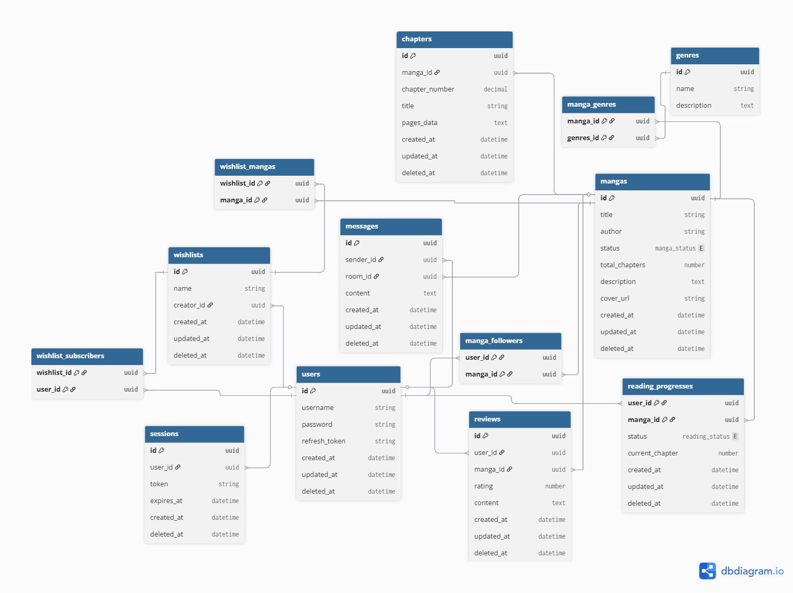
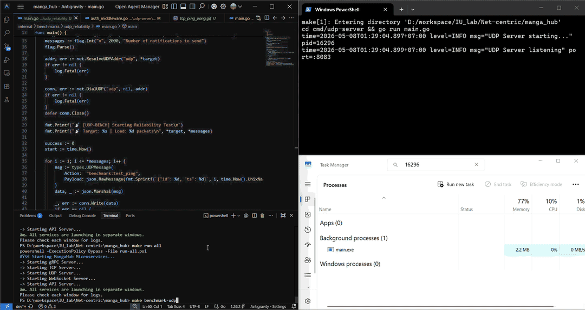

# MangaHub — Advanced Concurrent Networking Project in Go

[](https://golang.org/)
[](#)
[](https://opensource.org/licenses/MIT)

---

## Table of Contents
1. [Executive Summary](#1-executive-summary)
2. [System Architecture](#2-system-architecture)
3. [Performance & Benchmarks](#3-performance--benchmarks) 🚀
4. [Core Capabilities](#4-core-capabilities)
5. [Project Structure](#5-project-structure)
6. [Technology Stack](#6-technology-stack)
7. [Getting Started](#7-getting-started)
8. [API Documentation](#8-api-documentation)
9. [License & Contact](#9-license)

---

## 1. Project Overview
**MangaHub** is an exploration into building **concurrent, multi-protocol backend systems** using Go. Rather than a standard CRUD application, this project focuses on the architectural challenges of managing thousands of simultaneous stateful and stateless connections across **HTTP, TCP, UDP, gRPC, and WebSockets**.

### Architectural Goals
The primary goal was to implement a **Decoupled Gateway Architecture**. By isolating network-facing gateways (TCP/UDP/WS) from the core domain logic via **internal gRPC calls**, the system achieves strict protocol separation. This ensures that a resource-heavy broadcast in the TCP layer does not impact the availability of the REST API, and allows for protocol-specific optimization of the concurrency model.

---

## 2. System Architecture

MangaHub operates as a cluster of specialized gateway services communicating internally via an internal gRPC service layer.


### Database Schema Diagram


### Component Breakdown

*   **`api-server` (Public API Gateway)**: The primary entry point for all client applications, managing user identity and providing low-latency access to the content library and metadata.
*   **`tcp-server` (Cross-device, Real-time Sync)**: Enables seamless cross-device synchronization, ensuring a user's reading progress is instantly updated and accessible across their entire device ecosystem.
*   **`websocket-server` (Community Chat)**: Facilitates real-time, room-based social interactions, providing a low-latency environment for community engagement.
*   **`udp-server` (Broadcast Notifications)**: A low-overhead implementation for notifications, utilizing custom packet structures for efficient dispatch.
*   **`grpc-server` (Internal Service Layer)**: Acts as the central coordinator, providing a unified internal API for the various protocol gateways.

---

## 3. Performance & Benchmarks 🚀

### 3.1 Test Environment & Tools
*   **Hardware**: Windows 11, Intel Core i7 gen 10th (Ice-lake), 8GB RAM.
*   **Network**: All tests conducted over **localhost (loopback)** to isolate system-layer concurrency and throughput from external network latency.
*   **Testing Tools**: 
    *   `hey` for HTTP Throughput.
    *   Custom Go stress-test scripts for TCP & UDP reliability.

### 3.2 HTTP API Throughput (REST via gRPC)
*Tested with 200 concurrent users sending 20,000 requests to the `/api/v1/mangas` endpoint:*

| Metric | Result |
|:---|:---|
| **Average Latency** | `53.7 ms` |
| **p95 Latency** | `162.8 ms` |
| **p99 Latency** | `253.5 ms` |
| **Requests Per Second (RPS)** | `3,477+ req/sec` |


### 3.3 Real-time Connections (TCP)
*   **Concurrent Handling**: Successfully maintained **16,000+** active "Ping-Pong-Ack" sessions through the complete stack (Middleware -> Dispatcher -> Handler).
*   **Memory Footprint**: The entire TCP server consumed only **~240 MB** of heap RAM during peak load (16k connections).
*   **Efficiency**: Approximately **~15 KB** per active connection.
*   **Sync Performance**: 100% delivery of broadcast syncs in a simultaneous burst test.

<details>
<summary><b>📊 Click to view TCP Evidence</b></summary>

#### Real-time Processing (Ping-Pong-Ack Loop) & RAM Usage (16,000 Connections)


</details>

### 3.4 Reliability & Efficiency (UDP)
*   **High-Speed Processing**: Dispatched **16,000 packets** in just **8.8 ms**.
*   **Reliability**: Observed **100.00% delivery success** during controlled local environment testing (16,000 concurrent clients).
*   **Minimal Footprint**: The UDP server operates with an extremely low memory overhead of only **~35 MB** heap RAM.

<details>
<summary><b>📊 Click to view UDP Evidence</b></summary>

#### High-Speed Processing (16,000 packets in 8.8ms)



</details>

---

## 4. Technical Implementations
*   **Protocol Orchestration**: Managing unified session state across stateful (TCP/WS) and stateless (HTTP/UDP) transports.
*   **Cross-Protocol Auth**: RSA-signed JWT validation implemented consistently across all network gateways.
*   **Concurrency Management**: Custom dispatcher/handler patterns to manage 10k+ goroutines with minimal synchronization overhead.

---

## 5. Project Structure

Following **Domain-Driven Design (DDD)** and **Clean Architecture**:

```text
manga_hub/
├── cmd/                # Application Layer (Network Gateways)
│   ├── api-server/
│   ├── grpc-server/
│   ├── tcp-server/
│   ├── udp-server/
│   └── websocket-server/
├── internal/           # Protected Business Logic
│   ├── auth/
│   ├── database/
│   ├── grpc/
│   ├── manga/
│   ├── repository/
│   ├── tcp/
│   ├── udp/
│   ├── user/
│   └── websocket/
├── pkg/                # Shared Utilities & Clients
│   ├── clients/
│   ├── dto/
│   ├── logger/
│   ├── models/
│   ├── seeder/
│   └── utils/
└── proto/              # RPC Contracts
```

<details>
<summary><b>📂 Click to expand Full Directory Tree</b></summary>

```text
manga_hub/
├── cmd/
│   ├── api-server/
│   │   ├── controllers/
│   │   ├── middleware/
│   │   └── routes/
│   ├── grpc-server/
│   ├── tcp-server/
│   │   ├── dispatch/
│   │   ├── handler/
│   │   ├── middleware/
│   │   └── utils/
│   │       └── pool/
│   │           └── impl/
│   ├── udp-server/
│   │   ├── dispatch/
│   │   ├── handler/
│   │   ├── middleware/
│   │   └── utils/
│   │       └── pool/
│   │           └── impl/
│   └── websocket-server/
│       ├── handler/
│       ├── middleware/
│       └── utils/
│           └── pool/
│               └── impl/
├── data/
├── docs/
├── internal/
│   ├── auth/
│   │   └── impl/
│   ├── database/
│   │   └── impl/
│   ├── grpc/
│   │   └── impl/
│   ├── manga/
│   │   └── impl/
│   ├── repository/
│   │   └── impl/
│   ├── tcp/
│   │   └── impl/
│   ├── udp/
│   │   └── impl/
│   ├── user/
│   │   └── impl/
│   └── websocket/
│       └── impl/
├── pkg/
│   ├── clients/
│   ├── dto/
│   ├── logger/
│   ├── models/
│   │   └── enums/
│   ├── seeder/
│   ├── types/
│   └── utils/
│       └── jwt/
│           └── impl/
└── proto/
    ├── chapter/
    ├── manga/
    ├── message/
    ├── session/
    ├── user/
    └── user_manga/
```
</details>

### Architectural Patterns & Design Decisions

MangaHub is built with a focus on **long-term maintainability** and **testability**. Below is the rationale behind our structural choices:

#### 1. The `cmd/` vs. `internal/` Boundary
*   **`cmd/` (Delivery Layer)**: Each sub-directory represents a standalone executable. This separation ensures that the "how" (HTTP, gRPC, TCP, etc.) is strictly separated from the "what" (Business Logic). We can replace the web framework or add a new protocol gateway without ever touching the core domain logic.
*   **`internal/` (Protected Logic)**: By placing code here, we enforce Go's internal visibility rules. This prevents "circular dependency" nightmares and ensures that the core business logic cannot be accidentally imported by external projects, maintaining a clean and private API surface.

#### 2. Interface-Based Design & SOLID Implementation
Every service and repository in MangaHub is defined by an **Interface**, enabling a strict adherence to SOLID principles:
*   **Dependency Inversion (DIP)**: High-level business logic depends on abstractions, not concrete implementations. This decoupling allows us to inject different database or network providers without modifying the core domain.
*   **Liskov Substitution (LSP)**: All concrete logic resides in `impl/` packages that strictly satisfy their parent interfaces, ensuring that any implementation can be swapped without breaking the system.
*   **Interface Segregation (ISP)**: Interfaces are kept lean and domain-specific (e.g., `MangaRepository` vs. `UserRepository`), preventing "fat interfaces" and ensuring components only depend on the methods they actually use.
*   **Unit Testing & Mocking**: This pattern allowed us to achieve high test coverage using **Testify Mocks**, enabling the simulation of complex database states or network failures without external dependencies.

#### 3. Repository Pattern
Located within `internal/repository/`, this layer encapsulates all **GORM/SQLite** interactions. Business services never write raw SQL or interact directly with the database driver. This ensures that if we ever migrate from SQLite to PostgreSQL, we only need to change the code in one isolated package.

#### 4. Handlers, Dispatchers & Pools (Socket Management)
For non-HTTP protocols (TCP/UDP/WS), we implemented specialized patterns to manage concurrency while respecting the **Open/Closed Principle (OCP)** and **Single Responsibility Principle (SRP)**:
*   **Dispatchers (OCP)**: Acts as a central router for incoming socket messages. The system is **open for extension** (we can register new action handlers) but **closed for modification** of the core listener loop.
*   **Connection Pools (SRP)**: These are the state managers for distributed clients. They handle the complexity of thread-safe registration, unregistration, and **concurrent broadcasting** using Go's `channels` and `sync` primitives, isolating connection state from business logic.

#### 5. `pkg/` (Shared Utilities)
Contains truly agnostic utilities like the structured `logger`, `dto` (Data Transfer Objects), and cross-service `clients`. These are components that are generic enough to be moved to a separate library if needed.

---

## 6. Technology Stack
*   **Language**: Go (Golang) 1.21+
*   **Transport**: HTTP (Gin), gRPC (HTTP/2), TCP, UDP, WebSocket (Gorilla)
*   **Database**: SQLite + GORM (Relational mapping with 12+ entities)
*   **Observability**: Structured logging using `log/slog` for high-performance tracing.

---

## 7. Getting Started

### Prerequisites
*   Go 1.21 or higher.
*   `make` utility installed.

### Setup & Run
1.  **Configure**: `cp .env.example .env`
2.  **Initialize**: `go mod download`
3.  **Run All Services**:
    ```bash
    make run-all
    ```

---

## 8. API Documentation
*   **Interaction Examples**: See [`request.http`](./request.http) or [`request_example.http`](./request_example.http) for full REST API usage.
*   **Protobuf Specs**: Located in `/proto` for gRPC service definitions.

---

## 9. License & Contact
*   **License**: MIT
*   **Author**: Đào Hữu Hoài
*   **Email**: daohuuhoai2655@gmail.com